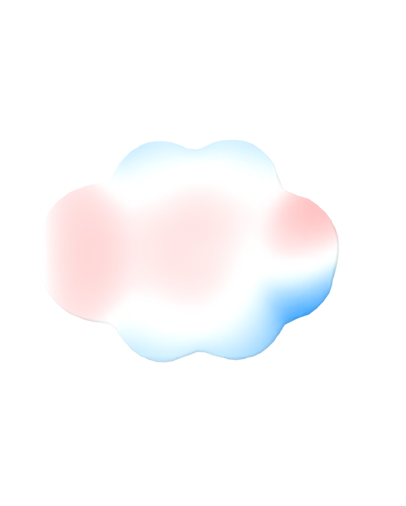

# cubeVis
A command line tool for generating 3D visualizations of cube files in VMD.

## Preqrequisites
Assumes you have VMD installed and in your PATH.

## Usage
```
bash cubeVis.sh [cube esp] [cube density] [bounds]
```
- `cube esp`: The cube file containing the ESP data.
- `cube density`: The cube file containing the electron density data.
- `bounds`: The scale factor for the ESP data. The ESP data will be cut off by this factor (+/-) before being visualized.

<!---
include image from data/esp-1.cube.tga
--> 

